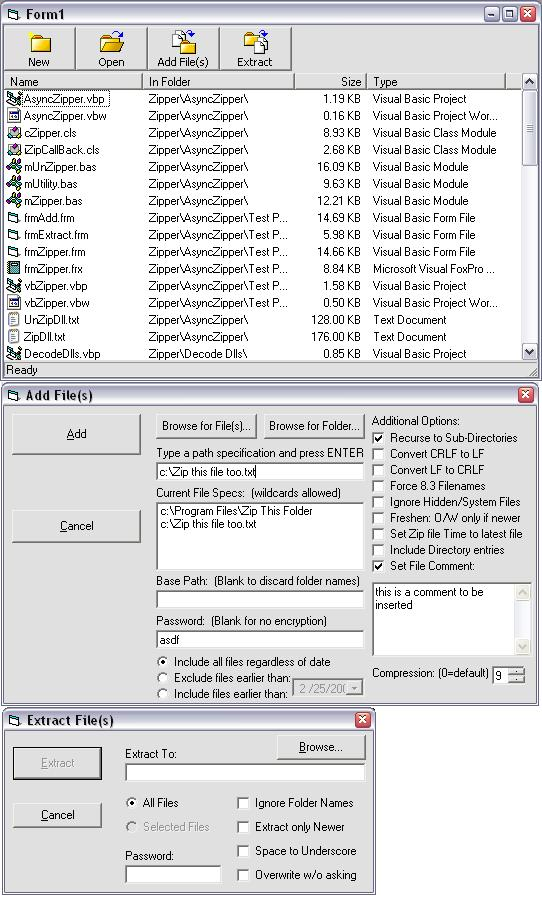



## Advanced Programmatic Zipfile functionality

### Description

This is an substantially updated version of my Basic Winzip Functionality Post. It's a complete wrapper around Infozip's open source compression (www.info-zip.org) I've seen several of these, but none as easy to use as this one. See the screenshot for the host of options available when zipping or unzipping files. Everything you need is included in the zip, just make sure to look at the readme file. Also, for those of you using vbAccelerator's cZip and cUnzip, you've got to check this out as an upgrade.
 
### More Info
 

             |
---                |---
**Submitted On**   |2004-02-25 17:31:22
**By**             |[selftaught](https://github.com/Planet-Source-Code/PSCIndex/blob/master/ByAuthor/selftaught.md)
**Level**          |Intermediate
**User Rating**    |3.9 (54 globes from 14 users)
**Compatibility**  |VB 6\.0
**Category**       |[Miscellaneous](https://github.com/Planet-Source-Code/PSCIndex/blob/master/ByCategory/miscellaneous__1-1.md)
**World**          |[Visual Basic](https://github.com/Planet-Source-Code/PSCIndex/blob/master/ByWorld/visual-basic.md)
**Archive File**   |[Advanced\_P1713432252004\.zip](https://github.com/Planet-Source-Code/selftaught-advanced-programmatic-zipfile-functionality__1-52005/archive/master.zip)

